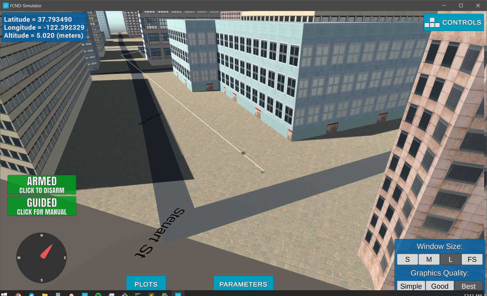
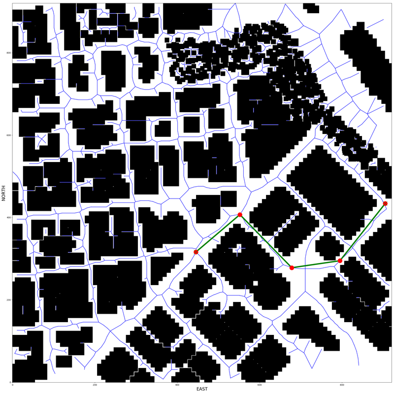

## Project: 3D Motion Planning

---

# Required Steps for a Passing Submission:
1. Load the 2.5D map in the colliders.csv file describing the environment.
2. Discretize the environment into a grid or graph representation.
3. Define the start and goal locations.
4. Perform a search using A* or other search algorithm.
5. Use a collinearity test or ray tracing method (like Bresenham) to remove unnecessary waypoints.
6. Return waypoints in local ECEF coordinates (format for `self.all_waypoints` is [N, E, altitude, heading], where the drone’s start location corresponds to [0, 0, 0, 0].
7. Write it up.
8. Congratulations!  Your Done!

## [Rubric](https://review.udacity.com/#!/rubrics/1534/view) Points
### Here I will consider the rubric points individually and describe how I addressed each point in my implementation.  

---
### Writeup / README

#### 1. Provide a Writeup / README that includes all the rubric points and how you addressed each one.  You can submit your writeup as markdown or pdf.  

You're reading it! Below I describe how I addressed each rubric point and where in my code each point is handled.

### Explain the Starter Code

#### 1. Explain the functionality of what's provided in `motion_planning.py` and `planning_utils.py`

`motion_planning.py` is the main script, which is mostly the same as `backyard_flyer.py` from Project #1.
The main difference is including the PLANNING phase between ARMED and TAKEOFF phases.
During the planning (in the `plan_path()` function) the grid is created from the map informaion (_colliders.csv_)
and then waypoints are created using A* algorithm on grid with example start and goal locations.
The list of waypoints is later sent to simulator and drone continues its mission.

`planning_utils.py` is mainly a definition of helpful functions that were developed in the exercises and consists of 2 main functions:
* `create_grid()` - takes 2D configuration space (loaded from _colliders.csv_) and returns grid with feasible and infeasible cells.
* `a_star()` - the implementation of A* algorithm (on grid), which finds shortest path from __start__ to __goal__ locations.

`valid_actions()` and `heuristics()` are simply used in `a_star()` for getting all possible actions (represented by `class Action`)
at current node and calculating `h` term at current node.

### Implementing Your Path Planning Algorithm

#### 1. Set your global home position
_Here students should read the first line of the csv file, extract lat0 and lon0 as floating point values and use the self.set_home_position() method to set global home. Explain briefly how you accomplished this in your code._

One of the first things to do in `plan_path()` function is to set the global_home position.
The position is read from 1st line of `colliders.csv` using simple regular expression.
Then function `set_home_position()` is called to set lat0 and lon0 values as global_home position. 

_And here is a lovely picture of our downtown San Francisco environment from above!_

Can't remove this lovely picture, so leave it here ;)

#### 2. Set your current local position
_Here as long as you successfully determine your local position relative to global home you'll be all set. Explain briefly how you accomplished this in your code._

Next we need to get current local position of the drone relative to global_home position.
In order to do this the utility function `global_to_local()` is used.

#### 3. Set grid start position from local position
_This is another step in adding flexibility to the start location. As long as it works you're good to go!_

The local position from previous step is used here as a starting point for the mission.

#### 4. Set grid goal position from geodetic coords
_This step is to add flexibility to the desired goal location. Should be able to choose any (lat, lon) within the map and have it rendered to a goal location on the grid._

The target (lat, lon) global coordinate can be specified as __--goal__ argument for the script in format of `12.345678,-123.456789`.
The altitude and safety distance are specified in corresponding variables in `plan_path()` function.

#### 5. Modify A* to include diagonal motion (or replace A* altogether)
_Minimal requirement here is to modify the code in planning_utils() to update the A* implementation to include diagonal motions on the grid that have a cost of sqrt(2), but more creative solutions are welcome. Explain the code you used to accomplish this step._

After all of the preparations are done, it is time to work with map. I first load data from `colliders.csv`.
Then this data along with TARGET_ALTITUDE and SAFETY_DISTANCE values goes into `create_grid_and_edges()` function.
This function creates 2D map (it can also be considered as 2.5D map, since the ma is going to be different
depending on TARGET_ALTITUDE value).

After the 2.5D map is created, the Voronoi graph is constructed (using the centers of obstacles).
Then edges that collide with obstacles are deleted and the rest of them are returned.
In order to remove invalid edges the Bresenham algorithm (from python package) is used.

The grid creation and edges extraction might take some time (~3-5s on my machine).

On the next step the graph is created out of these edges (using networkx package) and goal position (in local coordinates) is defined
(either random position or converted from lat/lon coordinates provided with __--goal__ argument)

In order to find path from start to goal positions the A* algorithm (on graphs) is used.
First, we need to find closest to start/goal positions nodes on graph.
Then A* uses BFS to find best path (Euclidean heuristics is used), which is also appended by start and goal positions.

#### 6. Cull waypoints 
_For this step you can use a collinearity test or ray tracing method like Bresenham. The idea is simply to prune your path of unnecessary waypoints. Explain the code you used to accomplish this step._

Last but not least thing to do, is to reduce number of waypoints (by discarding unnecessary ones).
This is done by iterating over waypoints and tracing path segments using Bresenham algorithm.

After all of this is done, the waypoints are stored (and sent to simulator for visualization).

This is the visualization of some path on map:

### Execute the flight
#### 1. Does it work?
It works, but needs some explanations.

##### Running instructions
First of all, there are 2 additional flags that can be specified in CLI:
* `--seed` - takes _(int)_ and sets random seed to this value (for making experiments reproducible)
* `--goal` - takes _(str)_ in format of `12.345678,-123.456789` and sets global target position to these values ('lat' and 'lon' correspondingly)

For reproducing path shown before simply run:
`python motion_planning.py --goal 37.793520,-122.392210`.
This command will calculate path to given point, fly there and close connection.

You can continue this by the following command: `python motion_planning.py --seed 701`.
This command will find random point, fly there, then find another random point, fly there and so on.  

##### Simulator problems
The next thing is the simulator.
Simulator of version 0.1.1 has some problems in it.
From the very beginning drone is spawned inside some sort of building, which prevents it to easily start mission.

To work with it I used simulator 'Motion Planning - v0.1.0', which does not have physics behavior on ceiling of this building
(meaning drone can easily pass through it). However, in 'Motion Planning - v0.1.0' simulator the heading component of target position does not work.

In 'v0.1.1 Simulator' everything works as well, but the behavior of the drone at the beginning is strange.

### Double check that you've met specifications for each of the [rubric](https://review.udacity.com/#!/rubrics/1534/view) points.
  
# Extra Challenges: Real World Planning

For an extra challenge, consider implementing some of the techniques described in the "Real World Planning" lesson. You could try implementing a vehicle model to take dynamic constraints into account, or implement a replanning method to invoke if you get off course or encounter unexpected obstacles.

